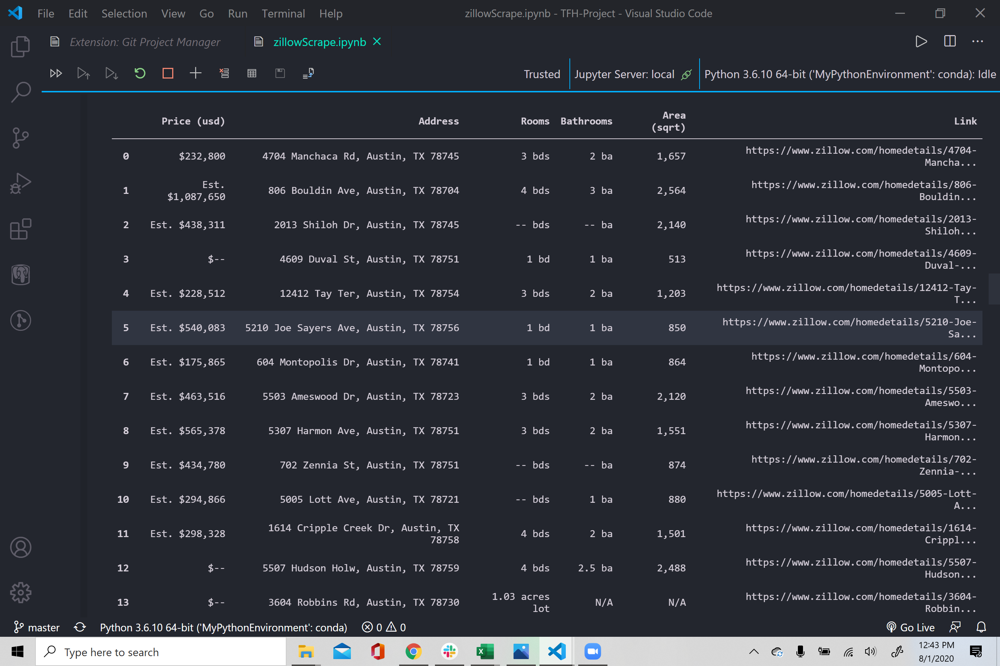
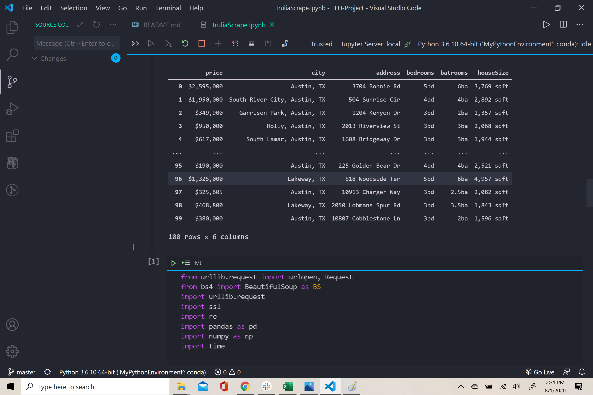
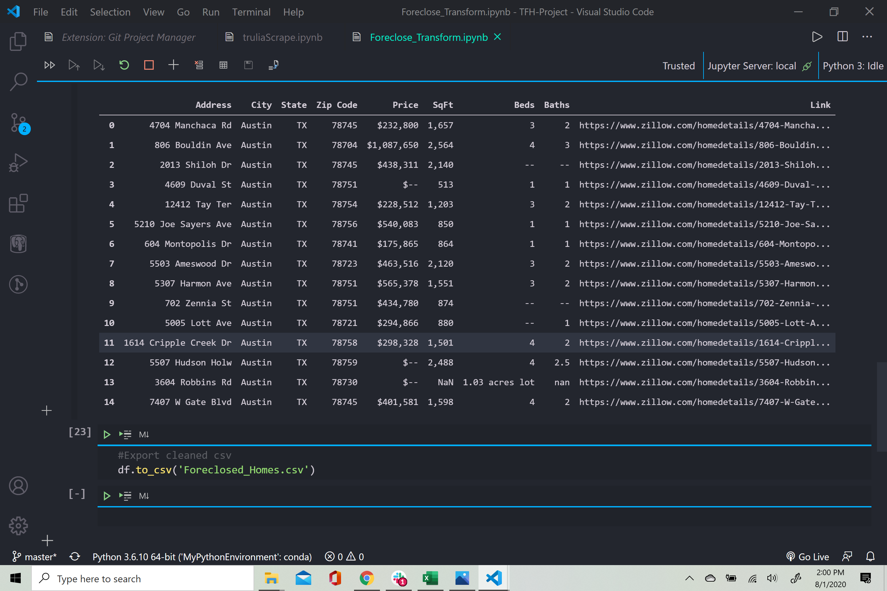
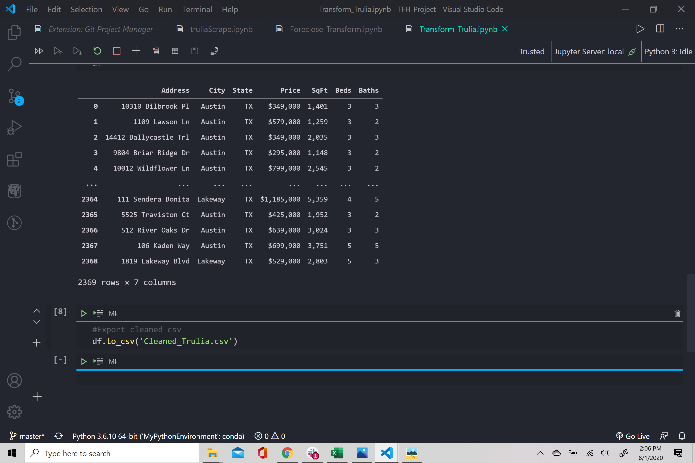
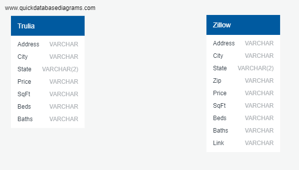

# Foreclosure Listings ETL Project

For our ETL project, we looked at recent foreclosures within the Austin, Texas market along with a complete list of homes for sale within the same market.  The finished product of this project consists of two tables.  

This project will be utilized for our second major project occurring in a few weeks' time.  In that project, we will broaden our scope to look at all foreclosures within the state of Texas and run analyses to determine which of the listings provide the largest return on investment (ROI).  We anticipate investors will use our database as their primary source for searching foreclosed properties to gain the greatest ROI.

For now, the following document will identify in detail the following technical aspects of the current ETL project:

- **Extract**  - where and how we got the data to pull into our database
- **Transform** -  what was done to get the data ready for our database
- **Load** - how we loaded the data into the database

---

## Extract

First, our team conducted research to find the most comprehensive listing of foreclosures available to potential investors today.  Most foreclosures were hidden within paid websites such as [Auction.com](https://www.auction.com) or [Foreclosure Listings](https://www.foreclosurelistings.com).  

Several websites had free listings. These websites only gave a subset of listings either based on the type of loan that was given, such as a [Freddie Mac](https://www.homesteps.com) or [Fannie Mae](https://homepath.com) type loan, or were properties listed as a bank sale by the bank, like [Wells Fargo](https://reo.wellsfargo.com)

### [Extracting Data from Zillow](Zillow_Scraper/zillowScrape.ipynb)

One website gave us both a comprehensive set of foreclosures along with the ability to obtain these listings at no cost to us: [Zillow](https://www.zillow.com).  

While Zillow gives this information out easily to a user accessing their website, they are just a reluctant to have a web scraper or a bot pull data from the same site.  Within its webpage, Zillow has placed several anti-scraping tools geared towards prohibiting the scraping of information from its website.  In order to assure Zillow we weren't just another bot, we used the following techniques to guide the process:

- Usage of Selenium rather than Splinter to open the Chromedriver for scraping.  Between Python's web scrapers, Selenium is considered the nuclear option when others fail.  Zillow's anti-scraping defenses required us to choose this option.
- Creation of a bot handler.  This allowed the person running the scraper up to 5 minutes to prove they were not a robot.
- Using numpy.random to create a variable lag time.  If requests go into Zillow with consistent cadence, Zillow still assumes a bot is scraping their website.  It will then lock out the user by banning the IP address associated with the scraping request.  Numpy.random creates an addition buffer to ensure we were not locked out permanently.
- Limiting the data to one market.  Since all team members are currently living in or near Austin, Texas we chose this as our test market for the scraper.

Foreclosure data was placed first into a Pandas DataFrame and then into a file in **csv format** for use in the __Transform__ phase.  The data scraper for Zillow can be found [here](Zillow_Scraper/zillowScrape.ipynb). Data extracted from Zillow's website had the following structure leaving the __Extract__ phase:

### [Extracting Data from Trulia](Trulia_Scraper/truliaScrape.ipynb)

Due to the difficulties we had with Zillow's bot handling along with the requirements of this assignment, our team chose a different website to scrape which still provided us a comprehensive look at home listings within the same market, Trulia. Our team did not encounter the anti-scraping techniques like we did with Zillow.  But first to access the data, we had to set up several cookies. These cookies included:

- Setting up a series of defaults values so that Trulia's website knows that it has a request asking to confer with it.
- Letting Trulia know that the requests will be coming in English.
- Allowing us to cache a resource but requiring us to revalidate it every time we use it.
- Sending a signal to the server expressing our preference for an encrypted and authenticated response.
- Letting Trulia know that we will be using Chrome as the browser we wish it to use for interactions.

Once these cookies have been set, we set the market to be the same as the output of the Zillow data - Austin, Texas.  Just as with the Zillow data, we first put the data into a Pandas DataFrame and then into a file in **csv format** for use in the __Transform__  phase. The data scraper for Trulia can be found [here](Trulia_Scraper/truliaScrape.ipynb).  

Data extracted from Trulia's website had the following structure leaving the __Extract__ phase:

---

## Transformation

### [Transforming Zillow](Zillow_Scraper/Foreclosure_Transform.ipynb)

Transformation of the zillowOutput.csv file involved primarily cleaning the data in order to get it into a structure ready for insertion into a SQL database.  This process included the following:

- Taking out the comments about estimated price in the price column.  This was switched over to a fixed price instead using the number in the respective value.
- Taking out redundancies in the bedroom and bathroom columns by removing 'bd' and 'ba' respectively.  
- Renaming the area column to SqFt.
- Separating out the address into four columns: Address, City, State, and Zip.
- Not removing homes if data was missing.  Instead, we chose to fill in that missing data with '--'.  We did this, rather than get rid of the listing, because foreclosures are different that normal sales of homes.  Many times, those listings will have incomplete data due to the forced sale of the property.

Once the data was cleaned, we created a new file in **csv format**. The code to transform the data can be found [here](Zillow_Scraper/Foreclosure_transform.ipynb)

Zillow's transformed data had the following structure:

### Transforming Trulia

Transformation of the truliaOutput.csv file involved primarily cleaning the data in order to get it into a structure ready for insertion into a SQL database.  This process included the following:

- Removing the redundancies in the bedroom and bathroom columns by removing 'bd' and 'ba' respectively.  
- Renaming the houseSize column to sqFt.
- Separating out the city column into two separate columns: City and State.  In addition, if there was a neighborhood identified in the web scrape and was a part of the 'city' column in truliaOutput.csv, then this neighborhood was removed.

Once the data was cleaned, we created a new file in **csv format**. The code to transform the data can be found [here](Trulia_Scraper/Transform_trulia.ipynb)

Zillow's transformed data had the following structure:

---

## Load

### PostgreSQL

Two separate tables were created using the Zillow data and Truilia data.  The SQL code for creating these two tables can be found [here](Zillow_Scraper/Zillow_SQL_Table.sql) and [here](Trulia_Scraper/Trulia_SQL_Table.sql).

This data was loaded into a PostgreSQL database.  While the database is currently non-relational, the expansion of information for our second main project will make this information relational as we bring in city-level information on crime rates, education opportunities, comparative homes sold, etc.

Here is a view of the database:

